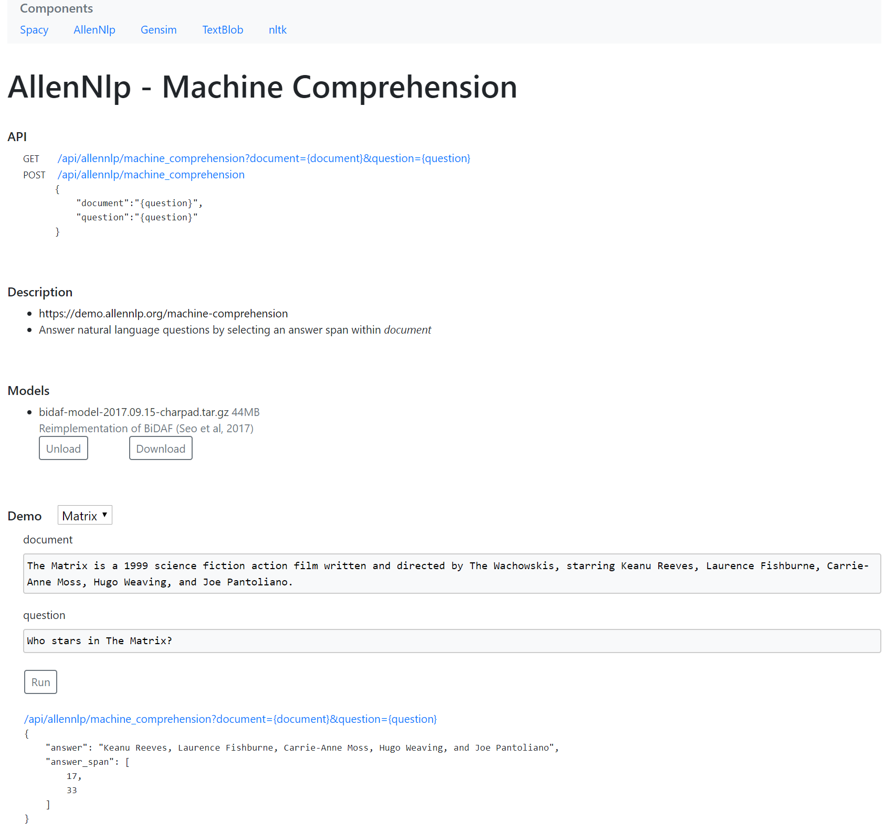

# nlp

Rest api for Spacy, Allennlp, gensim, nltk

### Download

| Windows       | macOS  | Linux  |
| ------------- |:-------------:| -----:|
| [nlp-0.1](https://github.com/golabek-io/nlp/releases/download/0.1/nlp-0.1.7z) |   |  |

### Service UI

### Spacy API
- [NLP](https://spacy.io)

  Tokenization, Noun chunks, Sentence Segmentation, Part-of-speech tagging, Named Entity Recognition, Word vectors

  /api/spacy/nlp?model={model}&document={document}
  
- [Similarity](https://spacy.io)

  Score the similarity between documents
  
  /api/spacy/similarity?model={model}&document={document}&similarTo={similarTo}

### Allennlp API
- [Machine Comprehension](https://demo.allennlp.org/machine-comprehension)

  Answer natural language questions by selecting an answer span within document
  
  /api/allennlp/machine_comprehension?document={document}&question={question}
  
- [Textual Entailment](https://demo.allennlp.org/textual-entailment)

  Predicts whether the facts in document necessarily imply the facts in hypothesis
  
  /api/allennlp/textual_entailment?document={document}&hypothesis={hypothesis}
  
- [Semantic Role Labeling](https://demo.allennlp.org/semantic-role-labeling)

  Predicates argument structure of a sentence. Answer basic questions about sentence meaning, including "who" did "what" to "whom" etc.
  
  /api/allennlp/semantic_role_labeling?document={document}
  
- [Coreference Resolution](https://demo.allennlp.org/coreference-resolution)

  Finds all expressions that refer to the same entity in a document.
  
  /api/allennlp/coreference_resolution?document={document}
  
- [Named Entity Recognition](https://demo.allennlp.org/named-entity-recognition)

  Identifies named entities (people, locations, organizations, and miscellaneous) in document
  
  /api/allennlp/named_entity_recognition?document={document}
  
- [Constituency Parsing](https://demo.allennlp.org/constituency-parsing)

  Breaks document into sub-phrases, or constituents.
  
  /api/allennlp/constituency_parsing?document={document}
  
- [Dependency Parsing](https://demo.allennlp.org/dependency-parsing)

  Finds all expressions that refer to the same entity in a document. Analyzes the grammatical structure of a sentence, establishing relationships between "head" words and words which modify those heads.
  
  /api/allennlp/dependency_parsing?document={document}
  
- [Open Information Extraction](https://demo.allennlp.org/open-information-extraction)

  Extraction of relation tuples, typically binary relations, from plain text, such as (Mark Zuckerberg; founded; Facebook).
  
  /api/allennlp/open_information_extraction?document={document}
  
### Gensim API
- [Summarization](https://radimrehurek.com/gensim/summarization/summariser.html)

  Summarizing is based on ranks of text sentences using a variation of the TextRank algorithm

  /api/gensim/summarization?document={document}
  
### nltk/TextBlob API
- [NLP](https://github.com/sloria/TextBlob)

  Tokenization, Part-of-speech tagging, Noun phrase extraction, Splitting text into sentences, Sentiment Analysis
  
  /api/textblob/nlp?document={document}
  
- [Spelling Correction](https://github.com/sloria/TextBlob)

  Spelling correction is based on Peter Norvig's "How to Write a Spelling Corrector"

  /api/textblob/spelling_correction?document={document}
  
- [Language Detection](https://github.com/sloria/TextBlob)

  Language detection is powered by the Google Translate API.

  /api/textblob/language_detection?document={document}
  
- [Translation](https://github.com/sloria/TextBlob)

  Language translation is powered by the Google Translate API.

  /api/textblob/translation?document={document}&language={language}
